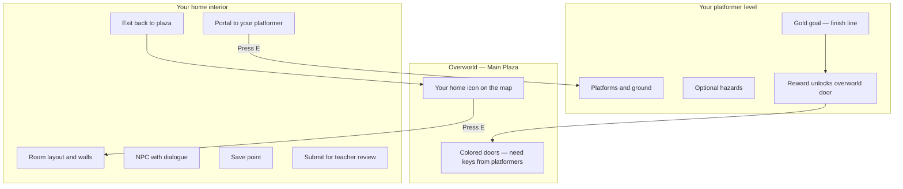

# Preparing Your World & Platformer

**Fundamentals of Video Game Design — Class Multiverse Overworld**

This is a **comprehensive reference** for the Class Multiverse project—not a week-by-week or day-by-day schedule. Your teacher will pull topics from here and fit them into the full **32-week** course plan. It explains what you are building, how the game is structured, and the **logical order** you should follow when authoring your world so it works in the class hub.

**Play the game:** [https://fvgd-flax.vercel.app](https://fvgd-flax.vercel.app)  
**Reference files:** `js/students/sample/` (teacher example)  
**Short technical reference:** [student-content-guide.md](student-content-guide.md)

---

## Table of contents

1. [Big picture: three layers of your game](#1-big-picture-three-layers-of-your-game)
2. [What success looks like](#2-what-success-looks-like)
3. [Controls you must know](#3-controls-you-must-know)
4. [Project milestones (do not skip ahead)](#4-project-milestones-do-not-skip-ahead)
5. [Your student pack: one folder, one world](#5-your-student-pack-one-folder-one-world)
6. [Phase A — Overworld presence (manifest & icon)](#6-phase-a--overworld-presence-manifest--icon)
7. [Phase B — Home interior (your room)](#7-phase-b--home-interior-your-room)
8. [Phase C — NPC dialogue (story & voice)](#8-phase-c--npc-dialogue-story--voice)
9. [Phase D — Platformer level (challenge)](#9-phase-d--platformer-level-challenge)
10. [Phase E — Rewards, doors, and the multiverse](#10-phase-e--rewards-doors-and-the-multiverse)
11. [Phase F — Save, test, submit for grading](#11-phase-f--save-test-submit-for-grading)
12. [Playtesting and revision](#12-playtesting-and-revision)
13. [Art, audio, and polish](#13-art-audio-and-polish)
14. [Rubric-aligned checklist](#14-rubric-aligned-checklist)
15. [Common mistakes and fixes](#15-common-mistakes-and-fixes)
16. [Topic index (for curriculum integration)](#16-topic-index-for-curriculum-integration)
17. [Glossary](#17-glossary)
18. [What you must not edit](#18-what-you-must-not-edit)

---

## 1. Big picture: three layers of your game

You are not building a whole engine from scratch. You are **authoring content** inside a shared class game—the **Class Multiverse Overworld**. Think of it like adding your own room and mini-game to a school building everyone shares.



| Layer | What players see | What you create |
|-------|------------------|-----------------|
| **Overworld** | Top-down plaza; colored squares are student homes | Manifest: name, position, icon color, link to your level |
| **Home** | Small room you walk inside; NPCs and objects | Room size, interactables (NPC, portal, exit, save, submit) |
| **Platformer** | Side-view jump level; reach the gold goal | Platforms (`solids`), optional `hazards`, spawn and goal |

The **engine** (movement, scenes, physics, UI) is teacher-owned. You work in **data** and **your student folder** only.

---

## 2. What success looks like

When your project is complete, a classmate should be able to:

1. Walk the Main Plaza and find **your** home icon.
2. Press **E** to enter your home and read your NPC dialogue.
3. Use your portal to play **your** platformer.
4. Reach the goal and earn a **reward** (for example a colored key).
5. Return to the overworld and use that key on the matching **colored door** (when your teacher wires it).
6. Save progress and (when logged in) **submit** work for your teacher to review.

If any step fails, fix the **data** for that step—do not change engine files to “force” it to work.

---

## 3. Controls you must know

Practice these on the live game and on your local copy (`index.html`).

| Input | Overworld & home | Platformer |
|-------|------------------|------------|
| **WASD** or **Arrow keys** | Move (four directions; **no diagonals** in the hub/home) | Left / right |
| **E** | Interact (enter home, talk, portal, save, submit, exit) | — |
| **Enter** | Start game / advance dialogue | Advance dialogue |
| **Escape** | Close dialogue | Leave platformer (return to home or overworld) |
| **Space** / **Up** / **W** | — | Jump (double jump only if you unlocked that skill elsewhere) |
| **F1** | Debug info (scene name, coordinates) | Same |
| **F2** | Show collision boxes (for debugging layout) | Same |

**Design tip:** Playtest with the same keys you will use in class demos. If something feels unfair in the platformer, change platform positions—not the engine.

---

## 4. Project milestones (do not skip ahead)

This is the **recommended build order**—not a calendar. Finish each milestone before relying on the next, whether that takes one class period or several.

```text
1. Icon & manifest approved     → You exist on the overworld map
2. Home graybox complete          → Room layout + exit + portal placeholder
3. NPC dialogue complete          → At least one character with multi-line speech
4. Platformer graybox complete    → Spawn → platforms → goal (winnable)
5. Gameplay pass                  → Hazards, difficulty tuning, reward linked
6. Art & audio polish             → Sprites, colors, sound (if assigned)
7. Playtest & revision            → Classmates play; you fix bugs
8. Submit for review              → Teal submit tile + teacher approval
```

**Why order matters:** The overworld icon is how others find you. The home is where story and the portal live. The platformer proves you can design challenge and pacing. Rewards connect your level to the **whole class** map.

---

## 5. Your student pack: one folder, one world

Each student gets a folder:

```text
js/students/your_id/
├── manifest.json    ← overworld listing (id, name, position, rewards)
└── pack.js          ← registers your home + links manifest to the engine
```

You also add **shared data** your pack points to:

```text
js/data/dialogueData.js      ← your dialogue lines (by key)
js/data/platformerLevels.js  ← your platformer layout
index.html                   ← one new line: load your pack.js (teacher may do this)
```

### Registering your pack

Your `pack.js` starts with `registerStudentPack({ ... })`. That connects you to the class hub automatically—**you do not edit** `overworldScene.js` to place your home.

`index.html` must load your script **after** `studentManifests.js` and **before** `homeRegistry.js`:

```html
<script src="js/students/your_id/pack.js"></script>
```

Ask your teacher when your line is added to the live site.

### Copy the sample first

```text
Copy:  js/students/sample/  →  js/students/your_id/
Edit:  manifest.json, pack.js, dialogueData.js, platformerLevels.js
```

Open the teacher’s **Sample Studio** in-game (purple icon) and compare what you see to `js/students/sample/pack.js`.

---

## 6. Phase A — Overworld presence (manifest & icon)

**Key idea:** You are claiming a plot on the class map.

### What the manifest does

`manifest.json` tells the overworld:

- **Who** you are (`name`, `author`, `description`)
- **Where** your icon sits (`position`: pixel x, y on the map)
- **How** it looks (`iconColor` — see allowed colors below)
- **Which** platformer and reward connect to you (`platformerLevelId`, `rewardId`)

### Example manifest fields

| Field | Meaning | Example |
|-------|---------|---------|
| `id` | Unique ID (no spaces); becomes scene name `home_<id>` | `"jordan_2026"` |
| `name` | Display name on prompts | `"Jordan's Lab"` |
| `author` | Your name | `"Jordan M."` |
| `iconColor` | Placeholder color until custom art | `"blue"` |
| `position` | Top-left of 32×32 icon on overworld | `{ "x": 544, "y": 448 }` |
| `locked` | `false` when ready for class to enter | `false` |
| `platformerLevelId` | Key in `platformerLevels.js` | `"jordan_platformer"` |
| `rewardId` | Key from reward palette (teacher assigns) | `"blue_key"` |

**Allowed icon colors:** `purple`, `blue`, `orange`, `gray`, `green`, `red`, `yellow`

### Phase A checklist

- [ ] Teacher assigned your `id` and map position (no overlapping other homes)
- [ ] `manifest.json` validates (commas, quotes, matching `id` in `pack.js`)
- [ ] Icon appears on overworld after refresh
- [ ] Press **E** at icon — prompt shows your home name
- [ ] Home is not `locked` when you are ready for visitors

### Design and identity

- The overworld is the **console** for the whole class—many student worlds, one plaza.
- Your icon is your **brand**; name and color should match your game theme.
- `id` must stay stable once saves and submissions exist—changing it breaks links and saves.
- Write a one-sentence **elevator pitch** for your world before you polish art; it keeps manifest, dialogue, and platformer aligned.

---

## 7. Phase B — Home interior (your room)

**Key idea:** Your home is a museum and lobby for your platformer.

### Room layout (in `pack.js` → `home`)

Homes are built from a **grid** of tiles:

| Field | Typical value | Notes |
|-------|---------------|-------|
| `tileSize` | `32` | Keep unless teacher says otherwise |
| `width` / `height` | e.g. `20` × `12` | Border tiles become walls automatically |
| `spawnTile` | e.g. `{ "x": 5, "y": 8 }` | Where the player appears inside |

The engine draws walls on the outer border. You place **interactables** inside the room.

### Interactable types (required set)

| Type | Color in game | Purpose |
|------|---------------|---------|
| `npc` | Yellow | Story, instructions, personality |
| `portal` | Purple | Launches your platformer |
| `exit` | Red | Returns to Main Plaza |
| `savePoint` | Green | Saves progress (local + cloud if logged in) |
| `submitPoint` | Teal | Sends work to teacher review queue |

Each interactable uses **tile coordinates** (`tileX`, `tileY`) and size in pixels (`width`, `height`).

### Example interactable (NPC)

```javascript
{
  type: "npc",
  id: "guide_npc",
  name: "Guide",
  dialogueKey: "jordanNpcIntro",
  tileX: 4,
  tileY: 2,
  width: 32,
  height: 32
}
```

The `dialogueKey` must exist in `dialogueData.js` (Phase C).

### Example portal

```javascript
{
  type: "portal",
  id: "level_portal",
  name: "Challenge Door",
  platformerLevelId: "jordan_platformer",
  tileX: 14,
  tileY: 4,
  width: 48,
  height: 48
}
```

`platformerLevelId` must match an entry you add in `platformerLevels.js`.

### Design goals for the home

- **Clear path:** Spawn → NPC → portal → exit without confusion.
- **One main story beat:** What is this place? Why should the player care?
- **Teaching:** NPC can explain controls before the platformer.
- **No dead ends:** Always reachable exit and save.

### Phase B checklist

- [ ] Room loads without console errors
- [ ] Player spawns inside walls, not stuck in border
- [ ] **E** on exit returns to overworld at the same plaza position
- [ ] Portal shows “Press E to enter platformer” (even if level is still placeholder)
- [ ] Save point shows confirmation message after **E**
- [ ] Submit point shows message (or “connect Supabase” if offline)

---

## 8. Phase C — NPC dialogue (story & voice)

**Key idea:** Dialogue is data—writers own the keys; the NPC only points to them.

### How dialogue works

1. You add an entry in `js/data/dialogueData.js`.
2. Your NPC’s `dialogueKey` matches that entry.
3. During play: movement pauses, **Enter** or **E** advances lines, **Escape** closes.

### Example dialogue block

```javascript
jordanNpcIntro: {
  speaker: "Guide",
  lines: [
    "Welcome to Jordan's Lab.",
    "We study gravity and impossible jumps here.",
    "Use the purple portal when you're ready."
  ]
},
```

### Writing guidelines

- **3–5 lines** minimum for a intro NPC; more for quest givers if assigned.
- **Speaker name** should match character role.
- **Second person** (“you”) often feels more game-like than lecture tone.
- Tie dialogue to **your platformer theme** (lava, space, school hallway, etc.).
- Proofread: dialogue is part of your grade.

### Phase C checklist

- [ ] Every `dialogueKey` in your pack exists in `dialogueData.js`
- [ ] No typos in keys (wrong key = silent or instant-close bug)
- [ ] Lines advance and close correctly
- [ ] Player cannot walk while dialogue is open

---

## 9. Phase D — Platformer level (challenge)

**Key idea:** Graybox first—make it fun with rectangles, then add art.

### Where levels live

Add your level object to `js/data/platformerLevels.js`:

```javascript
jordan_platformer: {
  id: "jordan_platformer",
  name: "Jordan's Lab — Trial Run",
  width: 960,
  height: 640,
  spawn: { x: 80, y: 400 },
  goal: { x: 820, y: 360, width: 40, height: 80 },
  rewardId: "blue_key",
  solids: [
    { x: 0, y: 560, width: 960, height: 80 }
    // more platforms...
  ],
  hazards: [
    // optional red spikes / pits
  ]
}
```

| Part | Role |
|------|------|
| `spawn` | Player start position (pixels) |
| `solids` | Brown platforms and ground (rectangles: x, y, width, height) |
| `hazards` | Red damage zones—touch resets to spawn |
| `goal` | Gold rectangle—touch to win and unlock reward |
| `rewardId` | Must match manifest and teacher’s reward palette |

### Physics you are designing around

The engine uses fixed jump and gravity (you do not change these in v2):

- Move left/right with WASD or arrows.
- Jump with **Space**, **Up**, or **W**.
- Fall with gravity; land on `solids`.
- Touch `hazards` → respawn at `spawn`.
- Touch `goal` → reward unlocked, return to home or overworld.

**Level design process (recommended):**

1. **Ground** — full-width floor so the player never falls forever.
2. **Steps** — a path of platforms a casual player can complete in 1–3 minutes.
3. **One optional hard path** — shortcut or secret for advanced players.
4. **Hazards last** — only after the level is completable without them.
5. **Goal placement** — visible from the last challenge; not hidden off-screen.

### Difficulty guidelines

| Audience | Guideline |
|----------|-----------|
| First playtest | Winnable without double jump |
| Class demo | 60–90 seconds for average player |
| Stretch | Hazards, tighter jumps, optional collectibles (future units) |

### Phase D checklist

- [ ] `platformerLevelId` in manifest matches key in `platformerLevels.js`
- [ ] Spawn is on solid ground
- [ ] Goal is reachable without impossible jumps
- [ ] **Esc** returns to home without breaking the game
- [ ] Completing goal grants reward (see rewards bar / door dialogue)
- [ ] Playtested by at least one other person

---

## 10. Phase E — Rewards, doors, and the multiverse

**Key idea:** Your platformer changes the shared world.

When a player beats your platformer, they earn the `rewardId` from your level (for example `yellow_key`, `blue_key`, `red_key`). Rewards appear in the HUD and unlock **colored doors** on the overworld.

| Reward ID | Typical use |
|-----------|-------------|
| `yellow_key` | Yellow door |
| `blue_key` | Blue door |
| `red_key` | Red door |
| `double_jump` | Skill (advanced units) |
| `dash` | Skill (advanced units) |
| `bridge_token` | Special areas |

Your teacher assigns which key your class uses so doors do not conflict. **Use only the ID you were assigned.**

### How rewards fit the fiction

- **Homes** are neighborhoods—identity and story.
- **Platformers** are trials that earn keys—skill and pacing.
- **Doors** are gates to shared districts—the class world grows together.

---

## 11. Phase F — Save, test, submit for grading

### Save point (green tile)

Press **E** at your save point to store:

- Overworld position  
- Visited homes  
- Unlocked rewards  
- Completed platformer levels  

Refresh the browser and confirm progress returns.

### Login (when class uses cloud saves)

Your teacher may give you:

- **Class code**
- **Student ID**
- **PIN**

Log in from the title flow when enabled. Then saves and submissions sync for grading.

### Submit for review (teal tile)

Press **E** at the submit point when logged in. Your teacher sees the submission in the admin queue. **Submit when phases A–D are done**, then revise after feedback.

### Personal test script (run every work session)

1. Open game → title → overworld.
2. Enter your home → talk to NPC → read all lines.
3. Enter platformer → reach goal → see reward.
4. Return overworld → try related door (locked vs unlocked dialogue).
5. Save → refresh → confirm progress.
6. Open browser console (**F12**) — **zero red errors** from your files.

---

## 12. Playtesting and revision

Playtesting is not a single step at the end—it is how you verify every phase.

### Who should playtest

- **You** — after every meaningful change; use F1/F2 and the console.
- **A partner** — fresh eyes on controls, readability, and difficulty.
- **Small group** — when home and platformer are both playable; capture written notes.

### What to observe

| Layer | Questions to ask |
|-------|------------------|
| Overworld | Can players find your icon? Is the name clear on the interact prompt? |
| Home | Is the path obvious? Do they know which tile is the portal vs exit? |
| Dialogue | Do they read all lines? Anything confusing or too long? |
| Platformer | Can they win without coaching? Where do they die repeatedly? |
| Rewards | After the goal, does the key show up? Does the matching door react? |

### Bug log habit

Keep a simple list: **what happened → what you expected → what you changed.** Your teacher may collect these during the semester; they also help you explain revisions at submit time.

### Revision priorities

1. **Blockers** — cannot enter home, portal broken, level unwinnable, console errors.  
2. **Clarity** — dialogue, prompts, layout confusion.  
3. **Feel** — jump distances, hazard fairness, pacing.  
4. **Polish** — color, art, audio (see next section).

---

## 13. Art, audio, and polish

Polish comes **after** graybox gameplay works. The engine currently uses colored rectangles for homes and platformers; custom art may be introduced as your course allows.

### Visual consistency

- Pick a **limited palette** (3–5 colors) that match your theme.
- Icon color on the overworld should relate to your home and level mood.
- NPC dialogue tone should match visuals (serious lab vs silly arcade).

### Optional asset workflow (when your class uses `assets/`)

```text
assets/students/your_id/
├── icon.png          (32×32 recommended for future icon swap)
├── home/             (tile sheets, portraits)
└── platformer/       (tiles, backgrounds)
```

Follow teacher naming rules. Do not replace engine files with art—add assets only where the course template supports them.

### Audio (if assigned)

- One ambient loop or sting for your home is enough for a first pass.
- Platformer: jump/land/hazard sounds reinforce feedback; keep volume consistent.

---

## 14. Rubric-aligned checklist

Use before submission and whenever your teacher reviews progress.

### Design & clarity

- [ ] Theme is obvious from name, dialogue, and level layout  
- [ ] Home teaches or sets up the platformer challenge  
- [ ] Difficulty matches class expectations (winnable, fair hazards)  

### Technical (content files only)

- [ ] `id` consistent across manifest, pack, platformer, dialogue keys  
- [ ] `index.html` loads your `pack.js` in correct order  
- [ ] No edits to `js/engine/` or `overworldScene.js`  
- [ ] Console free of errors caused by your pack  

### Interaction

- [ ] All interactables respond to **E** with correct prompts  
- [ ] Dialogue advances and closes properly  
- [ ] Platformer goal grants reward and returns player safely  

### Collaboration

- [ ] Playtest notes from classmates addressed or documented  
- [ ] Submitted on teal tile when your teacher enables grading  

---

## 15. Common mistakes and fixes

| Symptom | Likely cause | Fix |
|---------|--------------|-----|
| Home icon missing | `pack.js` not in `index.html` or wrong order | Add script before `homeRegistry.js` |
| “Press E” but nothing happens | Wrong tile position or `locked: true` | Check `position`, `locked`, interactable `tileX/Y` |
| Dialogue does not open | `dialogueKey` typo | Match key exactly in `dialogueData.js` |
| Portal does nothing | `platformerLevelId` missing in `platformerLevels.js` | Add level object with same id |
| Fall through floor | No solid under spawn | Add wide `solids` rectangle under player |
| Goal unreachable | Gap too wide or high | Shorten distance; add intermediate platform |
| Reward does not unlock | `rewardId` mismatch | Same id in manifest, level, and teacher palette |
| Red errors in console | JavaScript syntax in `pack.js` | Missing comma, bracket, or quote—fix before art pass |
| Changes not on live site | Only edited locally | Teacher deploys; you may need to push via class Git workflow |

**Mindset:** If something breaks, fix **your data** first. Ask for engine help only when the sample works but yours does not with identical structure.

---

## 16. Topic index (for curriculum integration)

Use this index when mapping content into a **32-week** (or any length) syllabus. Each row is a **topic block**—combine, split, or repeat as needed. Section numbers point to full detail in this document.

| Topic block | Primary sections | Typical student output |
|-------------|------------------|------------------------|
| Playing and analyzing the sample game | §1–3 | Completed playthrough of Sample Studio; controls memorized |
| Three-layer architecture | §1, §5 | Diagram or notes: overworld / home / platformer |
| Student pack setup | §5 | Folder copied; `registerStudentPack` understood |
| Manifest and overworld identity | §6 | Valid `manifest.json`; icon on map |
| Home layout and graybox | §7 | Enterable room; exit and portal placed |
| Interactables (all five types) | §7, §11 | NPC, portal, exit, save, submit wired |
| Dialogue writing | §8 | `dialogueData.js` entries; keys match NPCs |
| Platformer fundamentals | §9 | Floor, spawn, platforms, goal |
| Platformer hazards and tuning | §9, §12 | Fair hazards; playtest notes |
| Rewards and overworld doors | §10 | `rewardId` tested end-to-end |
| Save and cloud login | §11 | Save/restore verified |
| Submit for teacher review | §11 | Submission in teacher queue |
| Playtesting and iteration | §12 | Bug log; partner feedback addressed |
| Art, audio, polish | §13 | Visual/audio pass per rubric |
| Full project checklist | §14 | All rubric boxes ready |
| Debugging content | §15 | Self-serve fixes without engine edits |

**Dependency reminder:** Manifest (§6) before home (§7); home portal before platformer (§9); platformer before rewards test (§10); functional build before polish (§13) and submit (§11).

---

## 17. Glossary

| Term | Meaning |
|------|---------|
| **Overworld** | Top-down Main Plaza shared by the class |
| **Manifest** | JSON description of your home on the overworld |
| **Student pack** | `manifest.json` + `pack.js` in `js/students/<id>/` |
| **Interactable** | Object you press **E** on (NPC, portal, etc.) |
| **Dialogue key** | String linking NPC to text in `dialogueData.js` |
| **Graybox** | Rough layout with placeholders before final art |
| **Solid** | Platform rectangle in platformer data |
| **Hazard** | Red rectangle that resets player to spawn |
| **Reward** | Key or skill granted for beating a level |
| **Scene** | Full-screen game mode (title, overworld, home, platformer) |
| **Engine** | Teacher code that runs all scenes—you do not modify it |

---

## 18. What you must not edit

Unless you are assisting the teacher with engine work:

- Everything in `js/engine/`
- `js/scenes/overworldScene.js`, `titleScene.js`, `main.js`
- `js/engine/sceneManager.js`, `gameLoop.js`, `collision.js`, `input.js`

**You may edit:**

- `js/students/<your_id>/` (manifest + pack)
- Your lines in `js/data/dialogueData.js`
- Your level in `js/data/platformerLevels.js`
- Your assets under `assets/` when the class uses them (follow teacher naming rules)

---

## Quick reference card (print or slide)

```text
OVERWORLD     manifest.json → icon on map
HOME          pack.js → room + NPC + portal + exit + save + submit
DIALOGUE      dialogueData.js → keys match NPC
PLATFORMER    platformerLevels.js → solids, hazards, goal, rewardId
TEST          F12 console clean → save → refresh → submit
ORDER         Icon → Home → Dialogue → Platformer → Polish → Submit
```

---

## For teachers integrating this doc

This file is **not paced by weeks or days**. Map [§16 Topic index](#16-topic-index-for-curriculum-integration) into your **32-week** plan however fits units on design, narrative, systems, and production.

- Pull **Key ideas** and checklists from §6–§11 into slides when those systems are introduced—possibly weeks apart.
- Use §12–§13 whenever your course covers QA, playtesting, or polish—not only at the end.
- Live demo: [fvgd-flax.vercel.app](https://fvgd-flax.vercel.app) (Sample Studio → platformer → yellow door).
- Assign `id`, map `position`, and `rewardId` centrally to avoid overlaps.
- File-path quick reference: [student-content-guide.md](student-content-guide.md).
- Privacy and data: [privacy.md](privacy.md).

*Document version: aligns with engine **2.0.x** (student packs, platformer, rewards, submit flow).*
